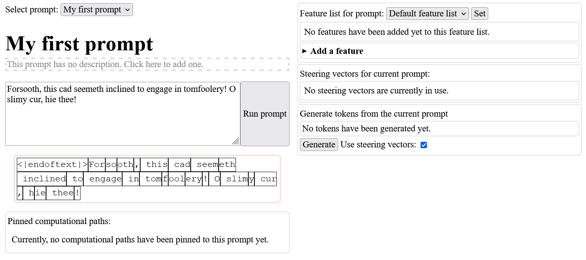

In this tutorial, we'll be learning how to perform *feature steering* using Peek. Feature steering means modifying the extent to which different features activate, in order to change the model's behavior.

# Loading our model and our dictionaries

We'll get started by following the first steps of the [main walkthrough](walkthrough.md).

Begin by running the Peek server and starting a new session with the model "GPT2-small". (The model name is already loaded in by default, so you just need to click the "Load model" button.) After you've done this, load in the standard set of GPT2-small transcoders by clicking the "Load" button next to "Load dictionaries from HuggingFace repo".

## Using SAEs in addition to transcoders

Thus far, these steps have been the same as in the main walkthrough. But here we will diverge: now, in addition to using transcoders, we'll make use of another type of dictionary called SAEs.

### Transcoders vs. SAEs

What is the difference between SAEs and transcoders? In brief: transcoders help you interpret the *computation of MLP sublayers in the model*, while SAEs help you interpret the *model's activations at a single point*. (For more details on the similarities and differences between transcoders and SAEs, please refer to our [transcoders paper](https://arxiv.org/pdf/2406.11944).) Another way to think of this is that transcoders are useful for finding out how information gets transformed throughout the model's computation in order to determine the final output, while SAEs are useful for telling you what the model is "thinking of" at a given point in its computation.

### My advice on steering with SAEs

Emperically, when playing around with feature steering using SAEs and transcoders in Peek, I've found that SAE features are more useful for steering than transcoders. In particular, I like using features from the model's residual stream, at a layer about halfway through the model (e.g. layer 6 in GPT2-small). However, in order to find which SAE features to steer with, transcoders are very useful, because they allow us to reverse-engineer through MLP sublayers. Thus, what I like to do is to load in one or two residual stream SAEs at a layer around halfway through the model (to use for steering), and then load in an entire set of transcoders for all layers of the model. That's what we'll be doing now.

### Loading in the SAEs

The SAEs that we'll be using come from [a set of open source SAEs trained on the residual stream of all layers in GPT2-small](https://www.lesswrong.com/posts/f9EgfLSurAiqRJySD/open-source-sparse-autoencoders-for-all-residual-stream) by [Joseph Bloom](https://github.com/jbloomaus). (Thank you, Joseph!) I repackaged these SAEs to make them compatible with Peek, and [uploaded them to Huggingface](https://huggingface.co/jacobdunefsky/gpt2-small-jbloom-24k-resid-pre-saes).

The name of this Huggingface repo is 

    jacobdunefsky/gpt2-small-jbloom-24k-resid-pre-saes

We can thus load in these SAEs by typing this name into the "Load dictionaries from Huggingface repo" box, and then clicking "Load".

Once we've loaded our SAEs, we can now see them next to our transcoders in our list of all dictionaries. But we don't need all of our SAEs -- it will be sufficient for our purposes if we just keep the layer 6 SAE, labeled "sae6pre". Thus, let's delete all SAEs *except for this one* by pressing the "X" button next to each SAE (but make sure not to delete any of the transcoders!).

After deleting all our SAEs (except for the layer 6 one), this is what you should see:

We're now ready to start investigating some prompts.

# Reverse-engineering archaic English

## Running our prompt

For our experiment, we'll be investigating whether the model understands (some of the principles underpinning) archaic English. For instance, consider a prompt like

> Forsooth, this cad seemeth inclined to engage in tomfoolery! O slimy cur, hie thee!

In this (overwrought) archaic prompt, does the model recognize the archaic language and predict that the last word is more likely to be "thee" than "you"? If so, then what features does the model use to predict this?

Navigate to the "Current prompt" pane and enter the above prompt into the textbox. Then, run the prompt.

## Defining our observable

Now, let's define an observable that measures the extent to which the model predicts that the next token is "thee" instead of "you". Click on the "Add a feature" box, and then define an observable with the weights and tokens shown below:

(Note that there's a space before each word in the token ` thee` and the token ` you`!)

## Finding computational paths

Now, let's find the activation of this observable on the `ie` token in the word "hie" preceding the word "thee". (This is because we want to measure the extent to which the model predicts that the token after this one will be "thee" or "you".) Click on this token in order to see the observable's activation.

When we do so, we'll see that our observable has an activation of 4.703 -- indicating that the model predicts that the token "thee" is highly more likely than the token "you".

Looks like our model was able to correctly recognize that this is a piece of archaic English!

The next step is to find which computational paths are important for causing this. Click on the observable activation to view the list of important upstream features, and recursively click on upstream features to explore which features are, in turn, important for causing them to activate.

If we do so, we can find a computational path involving a layer 6 SAE feature that seems to be important. This feature fires on a comma, suggesting that it might be a "summarization feature" that summarizes information about the context that it appears in (see Section 4 of [Tigges et al. 2023](https://arxiv.org/pdf/2310.15154)).

In fact, [looking up this feature on Neuronpedia](https://www.neuronpedia.org/gpt2-small/6-res-jb/8693) shows that it fires most strongly on sentences featuring archaic English language in religious texts such as the King James Bible and translations of the Quran. It therefore looks like we found a feature that is used by the model to detect archaic English! Let's add this feature to our feature list, so we can steer with it later.

# Time to steer

## A new prompt

Now that we've found a feature, let's try steering with it. First, we'll see if we can use this feature to make the model predict "thee" over "you" on another prompt.

Let's create another prompt: a sentence fragment which could be plausibly completed with either "thee" or "you". In particular, our prompt will be

    I've always wanted to tell

This time, the model extremely strongly predicts that the next token will be "you", and not "thee".

Can we change this with steering? If so, then this suggests that our layer 6 SAE feature really represents what we think it does. Let's now see how to actually steer with this feature.

## Performing steering

To carry out steering with our layer 6 SAE feature, first click on that feature's activation, as if one were seeking to recursively find computational paths for that feature.

But next, scroll down to the "Add a steering vector" box. Click on that box, and you will see a number of options allowing you to steer with this feature.

In the screenshot above, I've set the steering strength to be 30. This means that we'll add 30 times the feature vector to the model's hidden state. The other important option that I've set is to steer on all tokens. This means that the feature vector will be added to the model's hidden state at all token positions, rather than just the selected token. Right now, we want to steer on all tokens because we want to induce a more general change in behavior, but it can sometimes be useful to investigate steering on a single token, for example, to try and edit specific information about a given entity discussed in the prompt.

There are also some other options (steering with the encoder vector and using clamp-style steering) that we are not using now. Using these options can sometimes produce better (or different!) results, so it can be useful to experiment with them.

You can now add the steering vector to the prompt by clicking the "Add" button.

(For the curious reader: dictionary features (transcoder/SAE features) have both an encoder vector (representing the input to the feature) and the decoder vector (representing the output); so steering with one or the other can yield different results. Clamp-style steering is as described in [Templeton et al. 2024](https://transformer-circuits.pub/2024/scaling-monosemanticity/index.html), and involves setting a feature to have a specific activation rather than adding a feature to the model's hidden state.)

## Observing the results of steering

Now that we've added our steering vector, by looking at the right side of the prompt view, we can see a list of all steering vectors active on the current prompt.

When we add a steering vector, this changes the model's behavior. One way to see the results of this change is to see how feature activations change. If we go back to the "Current token" view (by clicking on "Current token" in the header at the top of the window), we can now see the change in the activation of our observable. In particular, by steering with this feature, we were able to increase the model's prediction that the next token will be "thee" over "you".

If you recurse on computational paths, you can also see how the upstream features' contributions change after steering too.

## Generating (steered and unsteered) continuations of a prompt

Another way to understand the effect of a steering vector is to have the model generate text while under the influence of the steering vector, and compare it to text generated without steering vectors. While this method of analysis is a bit more qualitative and "soft", it can still be useful for building intuitions.

To generate a continuation of the current prompt, look at the "Generate tokens from the current prompt" section of the "Current prompt" window. For easy comparison, you can choose whether to have the model generate text under the influence of steering vectors or without the steering vectors.

Here's an example of what it looks like to generate a continuation without steering vectors:

And here's an example continuation generated using steering vectors:

Notice the namedropping of Locke -- it seems like this feature causes the model to output text at a higher level of intellectual sophistication. (Also notice that the model becomes a bit less coherent; this is a common occurrence with steering vectors, especially when using high steering strengths.)

Similarly, another generation (albeit at the slightly lower steering strength  of 25 instead of 30) namedrops Sophocles, although it then proceeds to misspell "Parmenides" as "Parademides". (Note that I am not aware of any connection between Sophocles and Parmenides, although there might have been enough overlap in their lifetimes for the former to have been taught by the latter.)

And in the next generation, the model speaks of religion -- which makes sense, given that we saw earlier that this feature most strongly activates on excerpts from religious texts.

Overall, we can use steering to get a good sense of how a given feature causally impacts the model, both with respect to a given observable, and with respect to more general behavior.
