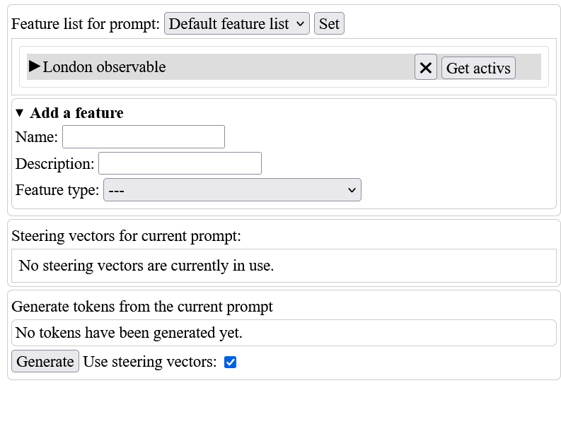
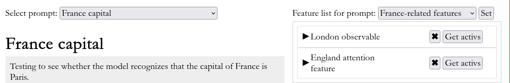

In this walkthrough, we'll be seeing how you can use Peek to understand how GPT2-small associates countries with their capital cities.

# First steps: loading our model and our transcoders

When you first start up Peek, you should see a screen like this:

To get started using Peek, you can either load a pre-existing session or start a new one. Because we don't have any session to load yet, we'll begin a new session.

Beginning a new session entails loading in the model that we want to investigate. By default, Peek loads in GPT2-small, whose model name is `gpt2`. In general, Peek supports all models available in [TransformerLens](https://transformerlensorg.github.io/TransformerLens), so if you'd like to work with other models, then a full list of supported models and their names can be found in [the TransformerLens model properties table](https://transformerlensorg.github.io/TransformerLens/generated/model_properties_table.html). But for now, we'll be using GPT2-small, so all we have to do is click the "Load model" button to get started.

(Note that if you haven't loaded a model yet since turning on your computer, **it will likely take a while for the model to load**. Don't worry: with a bit of patience, you'll be able to endure the wait. Subsequent loads of the same model (as long as you don't restart your computer) will be much faster, thanks to the magic of memory caching.)

Once the model is loaded, you should see this screen: 

This represents a blank session, with the default title "Untitled" and no description. You can also see information about our model at the top right.

## Adding a title and a description

To change the title, click on the current title "Untitled". This will display a textbox where you can type in the new title.

Similarly, to add a description, click on the box labeled "Click to add a description". Once you've added a description, you can edit it by clicking on the description again.

Because this walkthrough focuses on understanding how GPT2-small encodes information about capital cities, we'll choose a title and description to reflect this. After doing so, you should see a screen like this:

## Loading in our transcoders

Before we get started running our model on prompts, we should first load in the *transcoders* that we'll be using to analyze our model.

Transcoders are a type of interpretable feature dictionary (similar to SAEs, if you're familiar with them) that decompose the internal computations of a model's MLP sublayers into interpretable features. Making use of them is a core part of the Peek workflow, because they let us interpret how the model performs a computation across its layers.

The transcoders that we want to use must correspond to the specific model that we're investigating. Fortunately, one product of [our original transcoders research](https://arxiv.org/pdf/2406.11944) is a set of twelve transcoders -- one for each layer of GPT2-small -- which we've made available on Huggingface. The Peek-compatible release of these transcoders can be found at [huggingface.co/jacobdunefsky/gpt2-small-transcoders](huggingface.co/jacobdunefsky/gpt2-small-transcoders).

Peek supports loading a set of transcoders from a Huggingface repo (in addition to local paths). By default, Peek is prepared to load our GPT2-small transcoders, so all you have to do is click the appropriate "Load" button, as is shown below. (But if you wanted to load transcoders from a different Huggingface repo, you could just as easily type in the path for that repo.)

Once we've loaded our transcoders, we can now see a list of all the transcoders that we've loaded:

Every dictionary -- be it an SAE or a transcoder -- has a short name like `tc3mlp_in` that tells you whether the dictionary is a transcoder or an SAE (in this case, `tc` means "transcoder"), what layer the dictionary operates on (in this case, layer 3), and what sublayer the dictionary operates on (in this case, `mlp_in` means that the transcoder takes MLP inputs). Clicking on any of the transcoders provides more details.

# Our first prompt

## Running a prompt

Now, we're ready to start investigating the model's behavior on a prompt. For this first prompt, we'll look at whether the model knows that the capital of England is London. To get started working with prompts, click the "Current prompt" button at the top of the screen to scroll down to the prompt view.

To change the prompt's title and add a description, click on the current title/description. Let's make the title of the prompt "England capital", and let's make the description "Testing to see whether the model recognizes that the capital of England is London".

Scroll down to the prompt window and set the prompt's title and description accordingly. Then, in the prompt input textbox, type in the following prompt:

    As we all know, the capital of England is London.

After doing so, the prompt window should look like this:

 

Now, it's time to run the prompt by clicking the "Run prompt" button. After having done so, notice that below the prompt input textbox, we now also see the prompt text divided into tokens, as shown here:

By clicking on a token, we'll be able to see the activations of different features on that token. But before we can, we need to choose some features to investigate in the first place.

One way to do this is to run one of our dictionaries on a token and see which features are active. (You can do this by clicking on the token and using the "Get top dictionary features on current token" tool.) But Peek also makes use of a powerful method for determining which features are relevant for the task that you want to investigate.

## Observables: finding features for a given task

### What is an observable?

An **observable** is a special type of feature corresponding to a question that can be asked about the model's prediction for the next token. For example, if you want to know "how much more likely does the model predict the next token to be ` she` than ` he`?" or "is the logit prediction for the token ` London` greater than the average logit prediction for the tokens ` Paris`, ` Rome`, and ` Beijing`?", then you can construct observables corresponding to these queries.

In general, an *observable is defined by a set of tokens and a set of corresponding weights for each token*. The *activation* of an observable is given by the weighted sum of the model's logits for each of the tokens.

(Observables were first introduced [in my earlier research on the topic](https://openreview.net/pdf?id=ETNx4SekbY), where the more formal definition is provided that observables are "linear functionals on the logits of a language model". Interested readers are invited to read more.)

For this prompt, we want to understand whether the model is able to predict that London is the correct capital of England. To do so, we'll make use of the following observable, defined by its set of tokens and its set of corresponding token weights:

* ` London`: 1
* ` Paris`: -0.33
* ` Rome`: -0.33
* ` Beijing`: -0.33

What does this observable mean? Let's say that we pass the model the prompt

    As we all know, the capital of England is

and look at the model's next-token prediction logits on the ` is` token. If the model correctly knows that the capital of England is London, then the logit for London should be high, since this means that the model correctly recognizes that London should come as the next token. Conversely, the logits for Paris, Rome, and Beijing should be lower, since the model knows that these cities are not the capital of England. Thus, there should be a high difference between the logit for London and the average logit for the other cities.

### Adding an observable as a feature in Peek

Now that we know what an observable is and how we're going to use it, we can add our observable to our prompt's feature list. To do so, use the "Add a feature" menu next to the prompt input textbox. Choose a name and description for our feature. Then, for the "Feature type" dropdown, select "Observable". You will now see a place to input a token and its corresponding weight. Start by inputting the token ` London` and the weight 1. **Note that it is important to have a space before the word "London" (and before each of the other capitals' names), due to a quirk of the tokenizer.** To add in the other three tokens and their weights, click the "Add token" button.

After doing all of this, you should see the following screen:

Now, click the "Add feature" button to add the observable to our feature list. Once you've done so, you will see the observable appear in the feature list.

Click on it to view more details about it.

## Reverse-engineering our observable

### Getting our observable activation

We now have an observable that corresponds to the task -- i.e. prediction of London as the capital of England -- that we want to investigate. So let's go ahead and investigate! First, click on the token ` is` towards the end of the prompt.

This will show us the activation on this token of all of the features that we've added to our feature list. Right now, we've only added one feature to our feature list -- our observable -- so we'll only see the activation for that feature.

As we can see, the observable has an activation of 4.58 on this token. This means that the logit prediction for the next token being ` London` is 4.58 units greater than the average logit prediction for the next token being ` Paris`, ` Rome`, or ` Beijing`. Because logits are (approximately) log probabilities, this is a lot! Thus, this means that the model does in fact correctly predict that the capital of England is London.

### Looking at upstream features

The question, at this point, is how the model is able to correctly predict this. To answer this, we'll have to reverse-engineer our observable. Click on the observable activation in the list. This will then load more information the current observable activation -- and, more importantly, which earlier-layer features and components in the model are responsible for this activation.

It may take a bit of time for the information to load (especially if you have not previously used Peek since turning on your computer). But once it does, you should see the following window:

There's a lot going on here. But for now, it's most important to pay attention to the information labeled "Most important upstream features". As the label suggests, this is a list of the upstream features -- that is, features from earlier in the model -- that are most important for causing this observable to activate. Each upstream feature is listed along with its **attribution**, which quantifies how important the upstream feature is.

We can see that the most important upstream feature is `attn9[8]@9`. This means that the feature corresponds to attention head 8 in layer 9, at the token at position 9. This feature's attribution is 1.59, which means that when we consider that the observable has an activation of 4.58, this `attn9[8]@9` feature is directly responsible for 1.59 units of that activation -- around 35%.

### Recursing on upstream features

The next step is to recurse: which upstream features are most important for causing `attn9[8]@9` to activate? To answer this, click on `attn9[8]@9` in the list.

There are a couple of things to notice here. For one, we can see that the current token associated with this feature is different: this feature involves information from token 9, the ` England` token, rather than token 10 (which was the original ` is` token). This is because attention heads, like attention head 8 in layer 9, move information between tokens. (You can tell that you're looking at a different token now because the ` England` token is now the one that's highlighted.)

You might also notice that at the top of this window, the little information string has gotten a bit longer: instead of saying just "London observable@10: 4.581", it now says "London observable@10: 4.581 <- attn9[8]@9: 1.594". This indicates that we're no longer looking at just a single feature's activation. Rather, we're looking at a **computational path**, in which an upstream feature (attn9[8]@9) contributes to a downstream feature's activation (the London observable).

But the most important difference here is that the list of important upstream features has changed. Now, the list displays the most important upstream features for this `attn9[8]` feature. In particular, we see that the most important upstream feature is `tc0mlp_in[18874]@9` -- that is, feature 18874 in our layer 0 transcoder at token 9. This feature has an attribution of 0.68, which means that the total contribution of the feature to the observable's activation *through this computational path* is 0.68. (Note that this feature might contribute to the observable through other computational paths, too.)

Before we continue, notice that you can add a description to nodes in a computational path by clicking on the box labelled "Click to add a description". Let's add a description to this node.

Now, let's click on `tc0mlp_in[18874]` in the feature list, to further recurse.

### Looking at attribution information

At this point, we've recursed all the way back to the layer 0 MLP in the model. Now is a good time to go a bit more in-depth into how attributions are computed.

The attribution of a feature can be factorized into two types of factors: an **input-invariant factor** and **input-dependent factors**.

The input-invariant factor is a quantitative measurement of how important an upstream (earlier) feature is for causing a downstream (later) feature to activate in general -- without regard to a specific input. It is worth re-iterating: as the name suggests, *input-invariant factors reflect the global behavior of the model on all inputs, rather than just the behavior on one single input*.

Conversely, input-dependent factors tell us how important the downstream feature is *on a specific input*. There are three types of input-dependent factors:
* The **feature activation** is simply how much the feature is active on the input.
* The **attention score factor** tells us how much the model is attending to the current token on this specific input.
* The **LayerNorm scaling factor** is necessary to account for LayerNorm sublayers in the model.

By multiplying the factors with each other across all nodes in the computational path, you can obtain the total attribution.

The takeaway with Peek is that if you want to see all of this information, then click on the "Total attribution" dropdown.

### De-embeddings

De-embeddings are a type of input-invariant information that answers the question: which tokens in the model's vocabulary cause this feature to activate the highest? They thus allow you to understand the behavior of a feature without having to run the model on a dataset to find top activating examples.

Because de-embeddings look directly at the input tokens in the model's vocabulary, they work best for features in the earliest layers of the model. Our current feature is a transcoder feature in layer 0, so de-embeddings should work well for this feature.

To find the top de-embeddings, first click on the box labeled "Get top de-embeddings for feature".

Then, click on the "Get de-embeddings" button.

It looks like `tc0_mlpin[18874]` is mostly a single-token feature that fires on `England` or ` England`. Nice and interpretable! Let's edit the description for this node to make this clear.

### Our findings so far

We now have a sensible, interpretable computational path that helps us understand how the model computes the capital of England to be London. To sum things up:

* A layer 0 transcoder feature fires on the token ` England`.
* Layer 9 attention head 8 moves the information from this token to the token ` is`.
* This layer 9 attention head 8 promotes the logit for ` London` more than the logits for ` Paris`, ` Rome`, or ` Beijing`. Therefore, our "London observable" from earlier has a high positive value.

## Pinning computational paths

Now, we should save this computational path so that we can move on to further investigations. To do this, we can "pin" this computational path to our prompt.

First, click on the "Pin this computational path" box.

Next, type in a name and optional description, and then press the "Pin" button.

After doing so, the computational path will appear in the "Pinned computational paths" box up in the prompt window.

 

## Moving backwards in a computational path

Note that by clicking on one of the node names in a computational path, you can move backwards or forwards.

You can also click on a node name in the list of pinned computational paths to go directly to viewing that specific node.

## Adding features to our feature list

If there's a specific feature that you want to investigate further, you can add it to our current feature list. To do this, use the "Add to current feature list" box. You can optionally change the name of the feature or provide a description; otherwise, a name will be provided by default.

Let's go ahead and add our `attn9[8]` feature to our feature list as "England attention feature". First, click on the corresponding node in the computational path. Then, use the "Add to current feature list" box.

Once we've done this, we can now see the feature in our feature list.

# Our next prompt

## Computational path invalidation

At this point, you might want to poke around with this same prompt for a bit longer, exploring different computational paths and different features. But eventually, you'll probably want to experiment with a different prompt. If that's the case, then **it's important that you create a new prompt in the "Prompts" tab**. If you instead run the model again on the same prompt but with different text, then **this will invalidate all of the existing computational paths that you've pinned**.

When a computational path is invalidated, you can no longer view the most important upstream features for each node in the path, nor can you add nodes to the path. The reason why is that every node in a computational path is associated with a specific input to the model. If that input changes, then the computational path is no longer up-to-date with the new input.

You can still view existing attributions for an invalidated computational path. And a message will be displayed letting you know that the path is invalidated.

## Adding a new prompt

Thus, let's create a new prompt to further investigate this "England attention feature" that we found previously. To create a new prompt, scroll back up to the top of the page and click on the "Prompts" tab. Then, use the "Add a new prompt" box to, well, add a new prompt.

Now, let's switch over to this new prompt. Scroll down to the "Select prompt" dropdown and choose our new prompt.

Then, click the "Load" button to load it. We now have an empty prompt: let's add some England-y text to test our feature on, along with some France-y text as well.

## Getting feature activations on a prompt

Sometimes, it's convenient to be able to look at the activations of a feature on all tokens of a prompt at a glance. To do this, locate the feature that you're interested in in the feature list next to the prompt. Then, click on the "Get activs" button for that feature. Now, when you hover over the tokens from the prompt, you'll see the activation of the feature on that token. Let's do this using the "England attention feature" from before.

We can see that the activation of the feature on the token `shire` in "Lincolnshire" is 31.09 -- that's pretty high! In contrast, the feature has an activation of -20.48 on the token `aux` at the end of "Bordeaux".

# Managing feature lists

At this point, let's create another prompt -- to investigate whether the model knows that the capital of France is Paris. We now know how to add a new prompt and run it on some text, so let's do so.

Before we go ahead and create an observable for this prompt, though, we might want to do a bit of housekeeping. Specifically, we might want to group all of our England-related features together separately from all of our France-related features. We can do this by making use of *multiple feature lists*.

Scroll back up to the top, and click on the "Feature lists" tab. You'll see that we currently have only a single feature list in our session, which is blandly titled "Default feature list".

Let's rename this feature list to "England-related features" and give it a description, using the associated buttons.

Next, let's create a blank feature list, where we'll put our France-related features. To do so, click on the "Create a feature list" dropdown. Then, fill out the "name" and "description" fields.

The last step is to get our new "France capital" prompt to use this new feature list. To do this, go to the "Feature list for prompt" dropdown at the top of the prompt window. Then, select "France-related features".

Now, click "Set", and voila: we've set our feature list!

# Continuing our investigation

Having done all this, we can now repeat the process that we performed earlier when investigating the model's knowledge of London being the capital of England. To recap:

* Create an observable that captures the relationship that you're interested in. (In this case, the observable will measure the extent to which the model correctly predicts the token ` Paris` instead of ` London`/` Rome`/` Beijing`.)
* Click on the ` is` token in the prompt to get the observable's activation on that token.
* Recursively look at which upstream features contribute to this activation, and click on them to investigate them further.

By referring back to the earlier parts of this walkthrough, you should be able to find some computational paths and features used by the model to predict that Paris is the capital of France.

# Saving our work

At this point, we've found a lot of interesting results regarding how the model associates countries with their capital cities! Now, we'll see how to save this work, both so that you can pick up later from where you left off, and so that others can view your findings.

## Saving a Peek session as a .peek file

To save your session, scroll back up to the top of the page and take a look at the textbox marked "Session path". 

Type into this textbox the path and filename where you want to save this session. There are two things to note here:

1. Peek session files should be saved with the ".peek" extension.
2. **All paths are relative to the current directory where you're running the Peek server from.**

Keeping this in mind, let's save our session as "capital\_cities.peek". When you click the "Save session" button, a file named "capital\_cities.peek" should appear in the directory where you're running the Peek server from.

### Saving a .peek file without tensors

This file might be a bit big, though. At this point, it's around 1.3 MB large. This is because the file contains all of the tensors for each of the feature vectors in each of the computational paths and feature lists. Although this makes it possible to load in the session and be able to use all of Peek's capabilities, you might also want to save a smaller version of this file without these tensors -- for instance, if you want to upload the file to [peekai.org](https://peekai.org).

To save a .peek file without tensors, uncheck the checkbox marked "Save session with tensors", and then continue to save the session normally. Doing so brings the file size down to a mere 60 KB.

### Uploading to [peekai.org](https://peekai.org)

Once you've saved your findings in a .peek file, you can then upload it to [peekai.org](https://peekai.org) to share it with the broader community. For instance, the end result of this walkthrough has already been uploaded to [peekai.org](https://peekai.org), and you can [view the result by clicking this link](https://peekai.org/findings/1).

To upload your findings, [first log in to peekai.org using your GitHub account](https://peekai.org/login). Then, [click on the "Upload a finding" link at the top of the page](https://peekai.org/upload_finding). Once there, click on the button to browse for your .peek file and upload it. If your file is too big, then try saving it without tensors, as described above.

## Loading a Peek session from a .peek file

As you might expect, loading a Peek session can be done by typing in the path to the .peek file in the "Session path" textbox, and then clicking "Load session". 

## Exporting your findings as HTML

Another way to share your results is to export them as an HTML file. This can be done by using the "HTML export path" controls, right under the "Session path" controls. The resulting HTML file can be viewed by any browser that has Javascript support -- even if the viewer doesn't have Peek installed, or doesn't have an internet connection.

# Going forward

At this point, you're done with the walkthrough! By referring back to what you've already learned in the previous sections, you should be able to investigate additional behaviors that you're interested in.

There are also some other features of Peek that weren't covered yet in this walkthrough. For instance, if you're interested in learning how to perform *feature steering* with Peek, then you should read the [feature steering tutorial](steering_tutorial.md).

We hope that you have a fun time peeking inside LLMs with your newfound knowledge!
